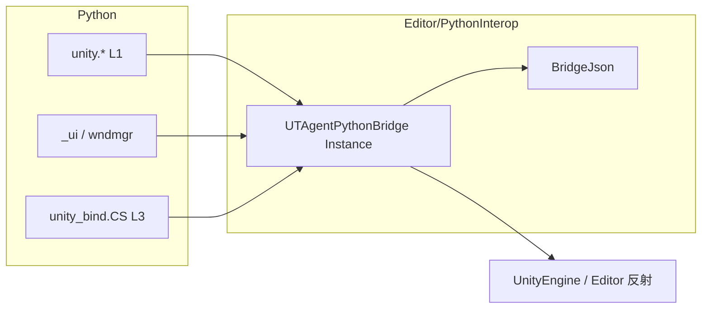

# PythonInterop：C# ↔ Python 桥

> 包内权威说明。改桥接 API / 注册名时先改本文与代码，再同步 `Python/agent/skills/python-interop.md.txt`。  
> 扩展落点见 [extension-points.md](./extension-points.md)；包地图对照宿主 `Docs/ut-agent/22`。

## 一句话

`Editor/PythonInterop` 是 **Unity 侧的「手」**：把 Editor 里能干的物理动作（找物体、改 Transform、截图、开窗、反射自省、CLR 解析等）暴露成 **pythonnet 可调用的 C# 实例方法**；Python 的 `unity.*` / UI / WndMgr / `CS.*` 只做薄壳，不在此目录写 LLM 编排。

## 原理（调用链）

```
utagent exec / Chat execPython
    → UTAgentBootstrap.Exec（持 GIL）
        → Python 脚本
            L1: import unity → _unity_bridge.<Method>(…) → JSON 字符串
            UI:  _ui_bridge / _wndmgr_bridge（同一实例，不同方法集）
            L3: from unity_bind import CS → _cs_bridge + pythonnet CLR
```

### 注册

`UTAgentBootstrap.RegisterBridgeModules` 把 **同一个** `UTAgentPythonBridge.Instance` 注册进嵌入式 Python 的 `sys.modules`：

| 模块名 | 用途 |
|--------|------|
| `_unity_bridge` | L1 场景 / GO / Transform / 截图 / SceneView / 自省 |
| `_ui_bridge` | UI 控件绑定、InvokeMember 等 |
| `_wndmgr_bridge` | 打开/关闭注册窗口 |
| `_cs_bridge` | L3 类型解析、预载程序集列表 |

历史原因拆成四个名字，实现上是 **一个 partial class 实例**，避免多套状态。

### 契约

1. **C# 方法返回 JSON 字符串**（成功带 `"success":true`，失败走 `BridgeJson.Error` / `Error(...)`）。
2. **Python 薄壳**（`Python/unity/*.py`）负责参数校验 → 调桥 → `json.loads`；侦察类 L1 动词还会 `_agent_echo` 打到 stdout，方便 Agent tool 结果可见。
3. **Editor API 多用反射**（如 SceneView），避免 Runtime asmdef 直接引用 `UnityEditor`。
4. **Lifecycle partial**（`Create` / `Dispatch` / `Destroy` / `Reload`）是 C# → Python 的反方向：Play 宿主通过桥回调 `unity.core.app.App`。



## 目录文件

| 文件 | 职责 |
|------|------|
| `UTAgentPythonBridge.cs` | 单例门面；Bootstrap 注册入口 |
| `…GameObject.cs` | 创建/销毁/查找层级、prepare 等 |
| `…Transform.cs` | 位置/旋转/缩放 |
| `…Unity.cs` | 日志、层次树、通用 Unity 动词 |
| `…SceneView.cs` | 截图、Scene 相机 zoom/pan/orbit、选中、存盘 |
| `…Reflection.cs` | L2 自省：命名空间/类型详情（过滤） |
| `…Interop.cs` | UI / WndMgr：开窗、控件路径、绑定 |
| `…Cs.cs` | L3：`CsResolveType`、预载程序集、`CsIsAllowed` |
| `…Lifecycle.cs` | Play 生命周期：Create/Dispatch/Destroy/Reload → `App.*` |
| `BridgeJson.cs` | 成功/失败 JSON、参数解析、转义 |
| `UnityModuleLogCollector.cs` | 订阅 Console，供 `GetRecentLogs` |

## 与三层互操作的关系

| 层 | Python 入口 | 本目录角色 |
|----|-------------|------------|
| L1 | `import unity` | 高频动词的 C# 实现体 |
| L2 | `unity.list_editor_namespaces` 等 | `Reflection` partial |
| L3 | `from unity_bind import CS` | `_cs_bridge` 解析 + pythonnet；**不是**再包一层 JSON 动词 |

扩展新能力时：

- 优先在 `Python/unity/*.py` 组合现有桥方法；
- 不够再给 `UTAgentPythonBridge` 加 partial 方法；
- **不要**为每个动词加 HTTP/CLI 子命令（见 extension-points）。

## 非职责

- LLM 循环 / Chat / session → `Editor/Agent`
- HTTP ping/exec → `Editor/RemoteCli`
- 引擎启停与 `sys.path` → `Editor/Core`
- 业务面板逻辑 → `Scripts/` 与 `Python/unity/ui`
