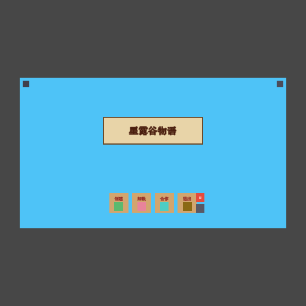
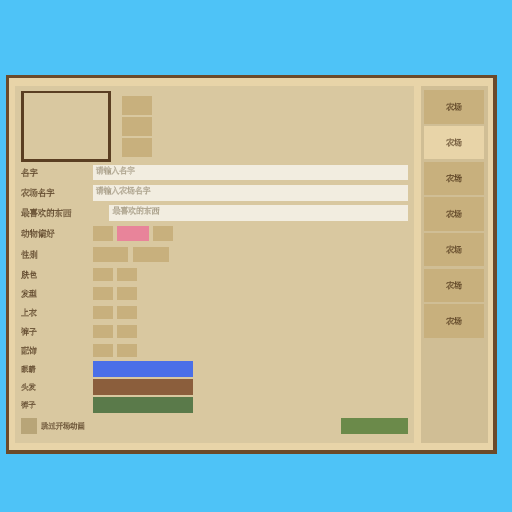
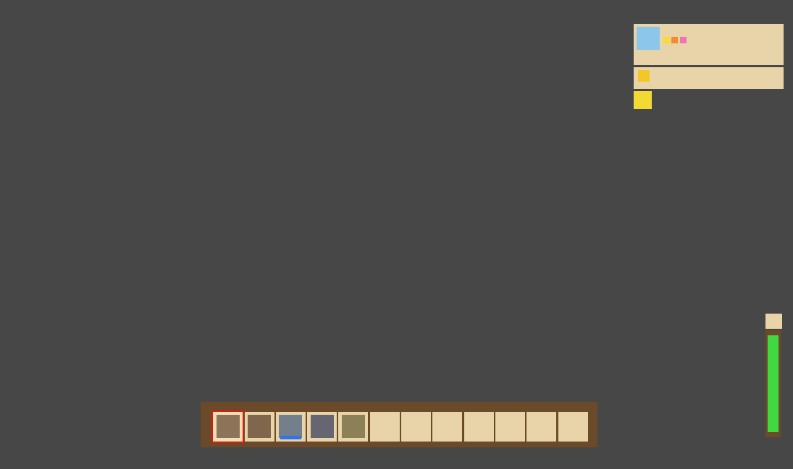
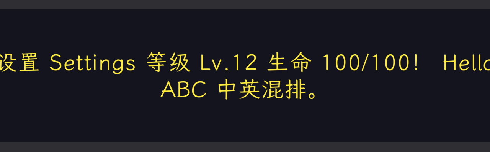

# UTAgent

在 Unity Editor 里嵌入 Python，用可执行脚本操控场景与 UI；上层用 harness（循环、钩子、skill、验收）约束 Agent 怎么做事。持续迭代中。

当前主练习：按自然语言在 Canvas 上拼界面（标题屏、设置/登录/角色、游戏内 HUD），拼完用脚本检查布局是否塌、节点是否脏。文末有截图。

## 安装

1. 把本目录放到项目的 `Assets/UTAgent/`
2. 按环境初始化 skill 做一次：[`Docs/skills/utagent-env-bootstrap/SKILL.md`](Docs/skills/utagent-env-bootstrap/SKILL.md)

配置、命令行、产物目录等：[`Docs/setup-and-config.md`](Docs/setup-and-config.md)

## 实现思路

### Python 互操作（L1 / L2 / L3）

对外只有一个入口：**跑一段 Python**（命令行 `utagent exec`，Chat 里 `execPython`）。脚本里怎么碰 Unity，分三层，**有现成动词就用上层，不够再往下**：

| 层 | 写法 | 干什么 |
|----|------|--------|
| **L1** | `import unity` | 高频动词：找物体、截图、层级、准备/销毁节点、Scene View 等 |
| **L2** | `unity.list_editor_namespaces` / `get_type_details` 等 | 过滤后的 API 自省，用来发现类型（不是日常拼 UI 主路径） |
| **L3** | `from unity_bind import CS` | 动态调已加载程序集里的 C#（`GameObject`、`UI`、TMP、`PrefabUtility`、业务类型等） |

拼 UI 典型是 **L1 + L3**：`unity.prepare_scene_object` 之类走 L1，创建控件、设 Layout、加 TMP 走 L3。有对应 L1 动词时不要无故跳到 L3。

下面是 UI 配方模板（居中窗口 + Layout + 标题 + 主按钮），可 `utagent exec --file` 跑：

```python
import json
import unity
from unity_bind import CS

def create_layout_panel(feature, title_text):
    root_name = f"Wnd{feature}"
    color_surface = CS.UnityEngine.Color(0.15, 0.15, 0.18, 0.98)
    color_text = CS.UnityEngine.Color(0.95, 0.95, 0.95, 1)
    color_accent = CS.UnityEngine.Color(0.23, 0.51, 0.96, 1)

    unity.prepare_scene_object(root_name)
    canvas = CS.UnityEngine.GameObject.Find("Canvas")
    if canvas is None:
        raise RuntimeError("Canvas not found")

    wnd = CS.UnityEngine.GameObject(root_name)
    wnd.transform.SetParent(canvas.transform, False)
    wnd.AddComponent(CS.UnityEngine.UI.Image).color = color_surface
    wnd_rt = wnd.GetComponent(CS.UnityEngine.RectTransform)
    wnd_rt.anchorMin = CS.UnityEngine.Vector2(0.5, 0.5)
    wnd_rt.anchorMax = CS.UnityEngine.Vector2(0.5, 0.5)
    wnd_rt.sizeDelta = CS.UnityEngine.Vector2(400, 280)

    panel_body = CS.UnityEngine.GameObject("PanelBody")
    panel_body.transform.SetParent(wnd.transform, False)
    vlg = panel_body.AddComponent(CS.UnityEngine.UI.VerticalLayoutGroup)
    vlg.spacing = 16
    vlg.padding = CS.UnityEngine.RectOffset(24, 24, 24, 24)
    vlg.childControlWidth = True
    vlg.childControlHeight = True
    vlg.childForceExpandWidth = True
    vlg.childForceExpandHeight = False
    body_rt = panel_body.GetComponent(CS.UnityEngine.RectTransform)
    body_rt.anchorMin = CS.UnityEngine.Vector2(0, 0)
    body_rt.anchorMax = CS.UnityEngine.Vector2(1, 1)
    body_rt.offsetMin = CS.UnityEngine.Vector2(0, 0)
    body_rt.offsetMax = CS.UnityEngine.Vector2(0, 0)

    title = CS.UnityEngine.GameObject("TxtTitle")
    title.transform.SetParent(panel_body.transform, False)
    title_tmp = title.AddComponent(CS.TMPro.TextMeshProUGUI)
    title_tmp.text = title_text
    title_tmp.fontSize = 28
    title_tmp.color = color_text
    title_tmp.alignment = CS.TMPro.TextAlignmentOptions.Center

    btn = CS.UnityEngine.GameObject("BtnSubmit")
    btn.transform.SetParent(panel_body.transform, False)
    btn.AddComponent(CS.UnityEngine.UI.Image).color = color_accent
    btn.AddComponent(CS.UnityEngine.UI.Button)
    label = CS.UnityEngine.GameObject("TxtLabel")
    label.transform.SetParent(btn.transform, False)
    lbl_rt = label.AddComponent(CS.UnityEngine.RectTransform)
    lbl_rt.anchorMin = CS.UnityEngine.Vector2(0, 0)
    lbl_rt.anchorMax = CS.UnityEngine.Vector2(1, 1)
    lbl_rt.offsetMin = CS.UnityEngine.Vector2(0, 0)
    lbl_rt.offsetMax = CS.UnityEngine.Vector2(0, 0)
    lbl_tmp = label.AddComponent(CS.TMPro.TextMeshProUGUI)
    lbl_tmp.text = "OK"
    lbl_tmp.fontSize = 18
    lbl_tmp.alignment = CS.TMPro.TextAlignmentOptions.Center

    unity.save_scene()
    return {"root_name": root_name}

print(json.dumps(create_layout_panel("Demo", "Demo Panel"), ensure_ascii=False))
```

桥与扩展细则：[`Docs/python-interop-bridge.md`](Docs/python-interop-bridge.md)。

### Harness（循环 · 策略 · 领域 · 编排）

这是 **另一套** 结构（包内文档有时也叫 L0–L3），**不要和上面的互操作 L1/L2/L3 混读**：

| 层 | 做什么 |
|----|--------|
| **内核循环** | 模型反复：决定下一步 → `execPython` / `loadSkill` → 看结果；含会话与上下文摘要 |
| **执行策略** | 跑代码前的硬门禁（与对话历史无关）：禁扫盘、限单步长度等；**Chat 与命令行共用**，记入 `Out/logs/exec_policy_*.log` |
| **领域包** | 这个域怎么写、执行前叮嘱什么、拼完怎么验（UI 见下） |
| **编排入口** | 谁开车：Editor Chat，或 Cursor + `utagent exec` |

UI 领域包目前挂了：

| 件 | 放哪 | 内容 |
|----|------|------|
| 操作封装 | `Python/unity/` | 互操作 L1 动词薄壳等 |
| 说明书 | `Python/agent/skills/editor-ui.md.txt` | 命名、布局套路、配色、可复制模板 |
| 执行前钩子 | Chat `BeforeExec` | 见下节 |
| 结果验收 | `Tools/ui-benchmark/run_assert_ui_scene_health.py` | 零高、Canvas 外孤儿、中文名、Layout preferred；HUD 可查槽位/最小尺寸 |
| Cursor 流程 | `agent-skills/utagent-unity-exec` | `skill get` → 多次 `exec --file` → 跑 assert |

加新域按同一清单挂，不改内核工具表（仍主要是 `execPython` + `loadSkill`）。权威表：[`Docs/extension-points.md`](Docs/extension-points.md)。

### 执行前 / 执行后（Chat）

在**执行策略**放行之后、真正跑 Python 之前（**before-exec**）：

- 代码像在拼 UI，但还没加载 `editor-ui` → 提醒先 `loadSkill`
- 加了 LayoutGroup 却没开 `childControlWidth/Height` → 提醒补布局控制（避免子控件塌成 0）

工具结果写回对话之前（**after-tool**）：

- 输出过长 → 截断
- 连续多步无进展 → 提醒或结束本轮

命令行单次 `exec` 不走对话钩子，靠执行策略 + 领域验收脚本。

### Skill 怎么写

文件在 `Python/agent/skills/*.md.txt`。Chat 用 `loadSkill("名字")` 注入；Cursor 用 `utagent skill list/get` 读同一文件。

以 `editor-ui` 为样板，通常写：

1. **约定** — 如窗口 `WndSettings`、按钮 `BtnSubmit`、节点名不用中文  
2. **套路** — 居中卡片 / 顶栏 / 底栏 / 表单列等，先选再写代码  
3. **可执行模板** — 像上文，改参数即可跑  
4. **验收指针**（可选）— frontmatter `assert:` 指向健康检查脚本  

Skill 教「怎么写」，不要塞整页业务终稿当标准答案；结果靠 assert 验。

### 两种用法

1. **Cursor + 命令行（日常拼界面）**  
   按 `editor-ui` 写多份 `.py`，`utagent exec --file` 打进 Unity，最后跑健康检查。创建角色、星露谷 HUD 走这条。

2. **Editor Chat**  
   Unity 窗口里对话，模型自己 `loadSkill` / `execPython`，会走 before-exec、after-tool；也可用跑表看它是否按规定做事。

## 测试

| | 内容 |
|---|------|
| **测试 1** | 小门禁：命名、Layout preferred、执行策略能否拦住危险代码 |
| **测试 2** | Cursor 多次 `exec` 拼出 UI，再跑场景健康（主练习） |
| **测试 3** | Editor Chat 按 brief 自己拼；跑表查 log（loadSkill、before-exec 等）再扫健康 |

```powershell
cd Assets/UTAgent/Tools/ui-benchmark
./run_benchmark.ps1          # 测试 1
./run_benchmark.ps1 -L2Only  # 测试 3（跑表历史参数名；指 Chat 用例集，与互操作 L2、领域包都无关）
```

测试 2：Cursor 使用 `utagent-unity-exec`，多次 `exec` 后执行 `Tools/ui-benchmark/run_assert_ui_scene_health.py`。

## 样例（持续迭代）

**标题屏**（Editor Chat）— `WndTitle`：



**创建角色**（Cursor + 命令行）：



**星露谷 HUD**（Cursor + 命令行）— 右上状态 / 底栏热键 / 精力条：



**中英 TMP 字体**（Cursor + 多次 `exec`）— 生成 Dynamic SDF、场景拼一句混排、截图验收：

→ [Docs/examples/lxgw-tmp-font-exec.md](Docs/examples/lxgw-tmp-font-exec.md)


